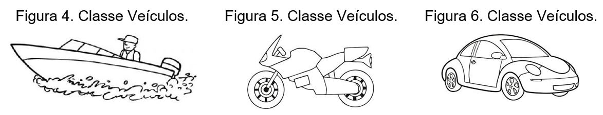

# PARADIGMA ORIENTADO A OBJETOS

## INTRODUÇÃO

>IMPORTANTE

>Como pudemos perceber, o conceito estruturado, seja no planejamento, seja na programação, foi entrando em declínio, dando espaço a uma nova forma de visualizar as “coisas”. Esse conceito surgiu com a necessidade cada vez mais dinâmica de se desenvolver software complexo, multifuncional, multiplataformas etc. Quando um software precisa crescer, toda sua estrutura, como documentação, programação, testes, validações, controle de qualidade, deve acompanhar na mesma velocidade. E é por isso que, atualmente, a orientação a objetos está como um padrão no desenvolvimento de sistemas. Porém, foi preciso que houvesse muitas mudanças de paradigmas para que a Oriented Object Programming (OOP) fosse aceita por Engenheiros, Arquitetos e Desenvolvedores. Tudo passou a ser pensado em objetos. A Orientação a Objetos trata de uma modelagem dos objetos do mundo real, estudando-os e criando classes a partir de suas características e comportamentos.

Segundo Rumbaugh (1994, p. 2), pensar baseado em objetos significa que o software será organizado como uma coleção de objetos separados que incorporam tanto a estrutura quanto o comportamento dos dados. Os objetos, portanto, serão os componentes que terão suas características e comportamentos abstraídos do mundo real para o mundo digital, ou seja, um componente concreto ou um conceito se tornará um componente de software. O objeto é um tipo abstrato que contém os dados e os procedimentos que manipulam esses dados. Segundo o dicionário, objeto é tudo que é manipulável e/ou manufaturável, tudo que é perceptível por qualquer um dos sentidos; o que é conhecido, pensado ou representado, em oposição ao ato de conhecer, pensar ou representar. Portanto, objeto é a representação de elementos físicos do mundo real.

### Saiba Mais

>O conceito de objetos também requer entendimento para que algumas características, como métodos e atributos, sejam agrupadas, gerando uma classificação. Usando a abstração, podemos classificar alguns objetos de acordo com seus comportamentos e atributos. A esse agrupamento, damos o nome de Classes. Uma classe é composta pela sua descrição, que identifica as propriedades da classe (atributos) e os métodos (comportamento). Assim, por exemplo, em um dado contexto, Esfera, Cubo, Círculo, Quadrado etc. podem se tornar a classe Forma Geométrica. Segundo Rumbaugh (1994, p. 3), cada classe descreve um conjunto infinito de objetos individuais. Cada objeto é dito ser uma instância de sua classe. Cada instância tem seu próprio valor para cada atributo, porém compartilha os nomes de atributos e operações com outras instâncias da mesma classe. As figuras a seguir mostram a classe Veículos, seus atributos e métodos.

