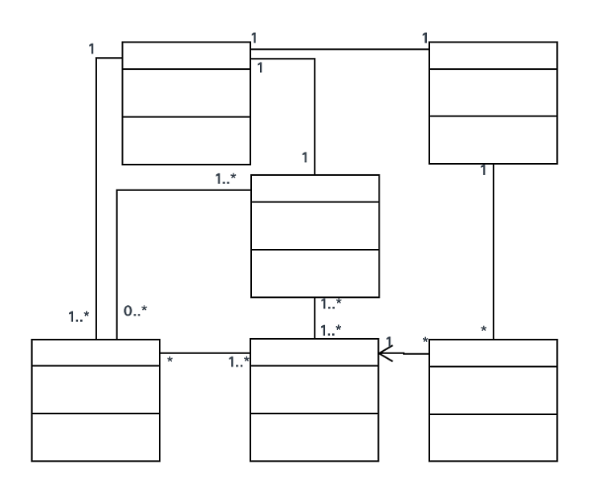
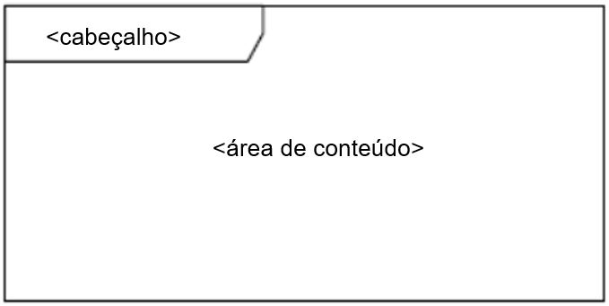
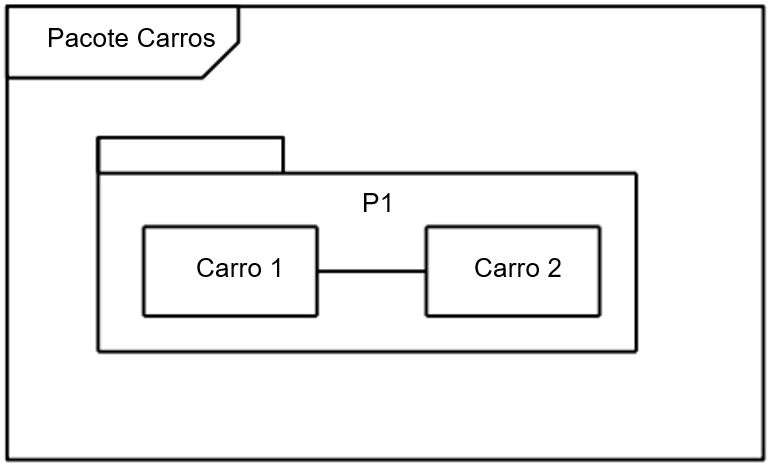
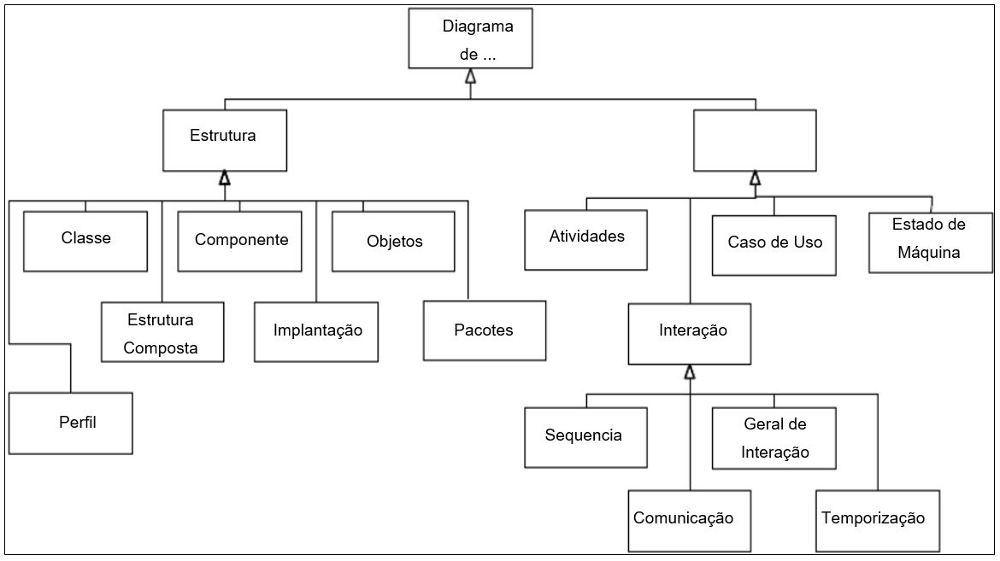
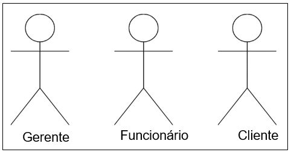
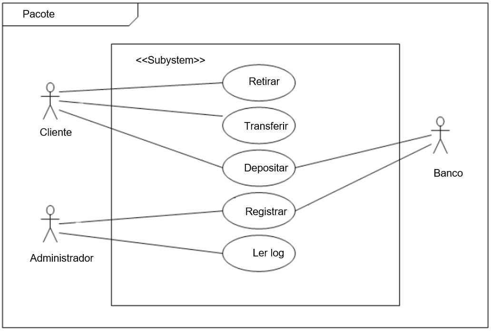
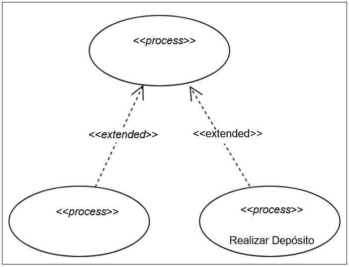

# UML

## INTRODUÇÃO

Quando se trata de modelagem de software orientado, vários recursos foram criados para agilizar todo o ciclo, desde sua ideia, concepção e implantação. Conforme as fronteiras sociogeográficas foram se rompendo, as equipes de desenvolvimento foram se tornando cada vez mais diversificadas em relação a idioma, cultura etc. Isso aconteceu com as linguagens de programação também. Inúmeras tecnologias surgiram, cada uma com suas particularidades, vantagens e desvantagens. Nesse momento, alguma tecnologia deveria surgir para que as pessoas envolvidas pudessem criar projetos de modelagem sem depender de plataforma de desenvolvimento e que todos pudessem falar a mesma língua: foi então que surgiu Unified Modeling Language (UML) ou Linguagem de Modelagem Unificada.

### Saiba Mais

>Segundo Guedes (2011, p. 19), a UML é uma linguagem visual, utilizada para modelar softwares baseados no paradigma de orientação a objetos. É uma linguagem de modelagem de propósito geral que pode ser aplicada a todos os domínios da aplicação.

A UML, apesar de o nome conter a palavra linguagem, não é uma linguagem de programação. Ela é uma linguagem visual, que define todas as características do sistema, mesmo antes do software começar a ser programado em uma linguagem de programação.

De acordo com Guedes (2011, p. 19), a UML surgiu da união de três métodos de modelagem: o método de Booch, o método OMT (Object Modeling Technique), de Jacobson, e o método OOSE (Object Oriented Software Engineering), de Rumbaugh. Em 1996, o trabalho de Booch, Jacobson e Rumbaugh resultou na primeira versão da UML, e a versão 2.0 foi lançada em 2005. Veja a documentação e histórico em <https://www.omg.org/spec/UML/2.5.1/PDF>.

Segundo OMG (2017, p. 683), um modelo UML consiste em elementos como pacotes, classes e associações. Os diagramas UML correspondentes são representações gráficas de partes do modelo UML e contêm elementos gráficos que representam elementos no modelo UML. Cada diagrama tem uma área de conteúdo. Como opção, pode ter um quadro e um cabeçalho:

Figura 7. Diagrama UML.

O cabeçalho do diagrama representa o tipo, o nome e os parâmetros do espaço de nome incluído ou o elemento do modelo que possuir elementos, representados por símbolos, na área de conteúdo.

Figura 8. Diagrama de Classe do Pacote P1.

Alguns diagramas representam as propriedades contidas em outro modelo. Sendo assim, serão definidos no espaço de nomes ou namespace. Como exemplo, duas classes associadas definidas em um pacote, em um diagrama para o pacote, serão representadas por dois símbolos de classe e um caminho de associação conectando essas duas classes símbolos (OMG 2017, p. 683).

Figura 9. Dois diagramas em um pacote.

## Diagramas

A finalidade da UML é ser uma linguagem de representação gráfica, ou seja, não existe nenhuma tecnologia específica, como uma linguagem de programação qualquer. Por isso, ao longo de sua evolução, vários diagramas foram sendo criados para atender diversos propósitos. É como se o sistema fosse modelado em camadas, sendo que alguns diagramas enfocam o sistema de forma geral, apresentando uma visão externa, como os Diagramas de Casos de Uso. A utilização de diversos diagramas permite que falhas sejam descobertas, diminuindo a possibilidade da ocorrência de erros futuros (GUEDES, 2001, p. 30).

Os diagramas podem ser divididos em Diagrama de Estrutura e Diagrama de Comportamento.

Figura 10. A taxonomia de diagramas de estrutura e comportamento.

## Diagrama de casos de uso

Um caso de uso é uma lista de ações ou etapas de eventos que normalmente definem as interações entre uma função de um ator e um sistema para atingir um objetivo. Um caso de uso é uma técnica útil para identificar, esclarecer e organizar os requisitos do sistema. Um caso de uso é composto de um conjunto de possíveis sequências de interações entre sistemas e usuários que define os recursos a serem implementados e a resolução de quaisquer erros que possam ser encontrados. Os diagramas de casos de uso da UML 2 fornecem uma visão geral dos requisitos de uso de um sistema. Eles são úteis para apresentações aos envolvidos na construção do sistema, mas, para o desenvolvimento real, você descobrirá que os casos de uso fornecem um valor significativamente maior, porque descrevem os requisitos reais.

### Saiba Mais

>Segundo Guedes (2009, p. 30), um diagrama de caso de uso é o mais geral e informal na UML, utilizado normalmente nas fases de levantamento de requisitos do sistema. Apresenta uma linguagem simples e de fácil compreensão para que os usuários possam ter uma ideia geral de como o sistema irá se comportar.

O diagrama de uso define interações entre atores externos e o sistema, para atingir objetivos específicos. Um diagrama de casos de uso contém alguns componentes principais, como os atores e caso de uso, e alguns não obrigatórios, como as caixas de limites e os pacotes.

## Ator

Ator é uma pessoa, organização ou sistema externo que desempenha um papel em uma ou mais interações com seu sistema. Segundo Guedes (2009, p. 53), os atores, além dos usuários do sistema, podem representar, eventualmente, hardware ou um software que interaja com o sistema; são representados por figuras de “bonecos magros” contendo breve descrição logo abaixo do seu símbolo que identifica que papel o ator assume dentro do diagrama.

Figura 11. Representação de atores.

## Caso de uso ou use case

Segundo a própria documentação da UML, os UseCases são um meio para capturar os requisitos dos sistemas, ou seja, quais sistemas devem ser feitos. Os principais conceitos especificados nessa cláusula são Atores, UseCase e Assuntos. Cada sujeito de UseCase representa um sistema sob consideração a que o UseCase se aplica. Usuários e quaisquer outros sistemas que possam interagir com um assunto são representados como atores. Um UseCase é uma especificação de comportamento. Uma instância de um UseCase refere-se a uma ocorrência do comportamento emergente que está em conformidade com o UseCase correspondente. Tais instâncias são frequentemente descritas por Interações.

### Saiba Mais

>Segundo Guedes (2009, p. 54), os casos de uso podem ser considerados primários, que se refere a processos importantes e enfoca um dos requisitos funcionais do software, como realizar um saque ou emitir um extrato. Já o secundário se refere como um processo periférico, como manutenção de um cadastro.

>Um UseCase é mostrado como uma elipse, contendo o nome do UseCase. Uma palavra-chave de estereótipo opcional pode ser colocada acima do nome. Um assunto para um conjunto de UseCases (às vezes, chamado de limite do sistema) pode ser mostrado como um retângulo com seu nome no canto superior esquerdo, com as elipses UseCase localizadas visualmente dentro desse retângulo.

Figura 12. Pacote que possui um conjunto de UseCases, atores e um subsistema.

## Documentação do caso de uso

Por meio de linguagem simples, a documentação do caso de uso descreve informações do caso de uso, dos atores, de suas interações, execuções dos atores e sistema. Entretanto, não existe um formato específico ou padronizações.

Segundo sugestão de Guedes (2009, p. 56), em primeiro lugar deve-se fornecer uma descrição para o caso de uso que está sendo documentado. Também deve possuir a informação do UseCase Geral, pois, como vimos, pode haver Casos de Uso que herdam as suas características. O campo ator principal se refere ao ator que mais espera o resultado ou que mais interage com o sistema. Podemos também apresentar uma linha com restrições e validações.

Tabela 1. Modelo sugestivo de documentação de Caso de Uso.

|NOME DO CASO DE USO|ABRIR CONTA|
|------------------|------------|
|Caso de uso Geral| -|
|Ator Principal|Cliente|
|Atores Secundários|Funcionário|
|Resumo|Esse Caso de Uso descreve as etapas percorridas por um cliente para abrir uma conta|
|Pré-condições|O pedido de abertura precisa ser previamente aprovado|
|Pós- condições|É necessário realizar um depósito inicial|
|Fluxo Principal||
|Ações do Ator|Ações do Sistema|
|1. Solicitar Abertura de Conta||
||2. Consultar cliente por seu CPF ou CNPJ|
|3. Informar a senha da cota||
||4. Abrir conta|
|5. Fornecer valor a ser depositado||
||6. Registrar depósito|
||7. Emitir cartão da conta|
|Restrições/Validações|1. Para abrir uma conta corrente é preciso ser maior de idade|
||2. O valor mínimo de depósito é R$ 5,00|
||3. O cliente precisa fornecer algum comprovante de residência|
|Fluxo Alternativo – Manutenção no cadastro do Cliente||
|Ações do Ator|Ações do Sistema|
||Se for necessário, executar Caso de Uso Manter Cliente para gravar ou atualizar o cadastro do cliente|
|Fluxo de Exceção – Cliente menor de idade||
|Ações do Ator|Ações do Sistema|
||1. Comunicar ao cliente que este não possui a idade mínima|
||2. Recusar o pedido de abertura|

## Estereótipos

Estereótipos são mecanismos de extensibilidade em UML que permitem aos projetistas estender o vocabulário da UML para criar novos elementos de modelo. Ao aplicar estereótipos apropriados em seu modelo, você pode tornar o modelo de especificação compreensível. Segundo Guedes (2009, p. 68), estereótipos podem atribuir funções extras ou diferentes a um componente, permitindo que este possa ser utilizado para modelar diferentes componentes e situações diferentes das quais foram originalmente projetados.

### Saiba Mais

>Existem vários elementos que podem ser aplicados aos componentes da UML e podem ser acessados em: <https://www.omg.org/spec/UML/2.5.1/PDF>, página 681.

Os estereótipos podem ser classificados em:

## Classe

- «auxiliary»: aplicado a uma classe que suporta outra classe, geralmente fornecendo mecanismos de controle. A classe suportada é uma classe de foco. 
- «focus»: aplicado a uma classe que especifica a lógica principal ou o controle com classes auxiliares que fornecem mecanismos subordinados. 
- «implementationClass»: é aplicado a uma implementação de uma classe em que a instância da classe não pode ter mais de uma classe. 
- «metaclass»: é aplicado a uma classe cujas instâncias são outras classes que estão em conformidade com a metaclasse. 
- «type»: é aplicado a uma classe que descreve o domínio de objetos e suas operações, mas não define a implementação de objetos. 
- «utility»: é aplicado a uma classe que não possui instâncias, mas cujos atributos e operações possuem escopo de classe.

## Artefato

- «document»: é aplicado a um artefato que representa um documento. 
- «executable»: é aplicado a um artefato que pode ser executado em um nó. 
- «file»: é aplicado a um artefato que contém código-fonte ou dados. 
- «library»: é aplicado a um artefato que é um arquivo de biblioteca estático ou dinâmico. 
- «script»: é aplicado a um arquivo que pode ser interpretado por um sistema de computador. 
- «source»: é aplicado a um arquivo de origem de um arquivo executável.

## Operação

>» «create»: é aplicado a uma operação que cria uma instância do classificador; por exemplo, se a operação for um construtor. 

>» «destroy»: é aplicado a uma operação que destrói uma instância do classificador.

## Componente

- «buildComponent»: é aplicado a um componente que especifica um conjunto de componentes para o desenvolvimento organizacional ou no nível do sistema. 
- «entity»: é aplicado a um componente que representa um conceito de negócio. 
- «implement»: é aplicado a um componente que não possui uma especificação e é uma implementação de uma especificação na qual ele possui uma dependência. 
- «process»: é aplicado a um componente que é baseado em transação. 
- «service»: é aplicado a um componente que calcula um valor. Esse componente não tem estado
- «subsystem»: é aplicado a um componente que faz parte de um sistema maior.

## Pacote

- «framework»: é aplicado a um pacote que contém elementos reutilizáveis, como classes, padrões e modelos. 
- «modelLibrary»: é aplicado a um pacote que contém elementos de modelo para reutilização. 
- «perspective»: é aplicado a um pacote que contém apenas diagramas ou subpacotes. Os extratores ignoram pacotes que possuem esse estereótipo aplicado.

## Modelo

- «metamodel»: é aplicado a um pacote que contém um modelo que é uma abstração de outro modelo. 
- «systemModel»: é aplicado a um modelo ou pacote que contém os modelos que descrevem diferentes perspectivas de um sistema.

## Classificador

>» «realization»: é aplicado a um classificador que especifica o domínio dos objetos e sua implementação. 

>» «specification»: é aplicado a um classificador que especifica o domínio de objetos, não sua implementação.

## Uso

- «responsibility»: é aplicado a uma nota que descreve a obrigação de um elemento de modelo para outros elementos do modelo.

Figura 13. Estereótipos em classes.

