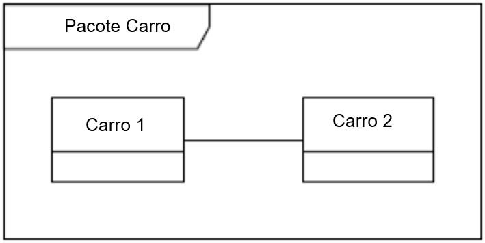

# UML

## INTRODUÇÃO

Quando se trata de modelagem de software orientado, vários recursos foram criados para agilizar todo o ciclo, desde sua ideia, concepção e implantação. Conforme as fronteiras sociogeográficas foram se rompendo, as equipes de desenvolvimento foram se tornando cada vez mais diversificadas em relação a idioma, cultura etc. Isso aconteceu com as linguagens de programação também. Inúmeras tecnologias surgiram, cada uma com suas particularidades, vantagens e desvantagens. Nesse momento, alguma tecnologia deveria surgir para que as pessoas envolvidas pudessem criar projetos de modelagem sem depender de plataforma de desenvolvimento e que todos pudessem falar a mesma língua: foi então que surgiu Unified Modeling Language (UML) ou Linguagem de Modelagem Unificada.

### Saiba Mais

>Segundo Guedes (2011, p. 19), a UML é uma linguagem visual, utilizada para modelar softwares baseados no paradigma de orientação a objetos. É uma linguagem de modelagem de propósito geral que pode ser aplicada a todos os domínios da aplicação.

A UML, apesar de o nome conter a palavra linguagem, não é uma linguagem de programação. Ela é uma linguagem visual, que define todas as características do sistema, mesmo antes do software começar a ser programado em uma linguagem de programação.

De acordo com Guedes (2011, p. 19), a UML surgiu da união de três métodos de modelagem: o método de Booch, o método OMT (Object Modeling Technique), de Jacobson, e o método OOSE (Object Oriented Software Engineering), de Rumbaugh. Em 1996, o trabalho de Booch, Jacobson e Rumbaugh resultou na primeira versão da UML, e a versão 2.0 foi lançada em 2005. Veja a documentação e histórico em <https://www.omg.org/spec/UML/2.5.1/PDF>.

Segundo OMG (2017, p. 683), um modelo UML consiste em elementos como pacotes, classes e associações. Os diagramas UML correspondentes são representações gráficas de partes do modelo UML e contêm elementos gráficos que representam elementos no modelo UML. Cada diagrama tem uma área de conteúdo. Como opção, pode ter um quadro e um cabeçalho:

Figura 7. Diagrama UML.

O cabeçalho do diagrama representa o tipo, o nome e os parâmetros do espaço de nome incluído ou o elemento do modelo que possuir elementos, representados por símbolos, na área de conteúdo.

Figura 8. Diagrama de Classe do Pacote P1.

Alguns diagramas representam as propriedades contidas em outro modelo. Sendo assim, serão definidos no espaço de nomes ou namespace. Como exemplo, duas classes associadas definidas em um pacote, em um diagrama para o pacote, serão representadas por dois símbolos de classe e um caminho de associação conectando essas duas classes símbolos (OMG 2017, p. 683).

Figura 9. Dois diagramas em um pacote.

## Diagramas

A finalidade da UML é ser uma linguagem de representação gráfica, ou seja, não existe nenhuma tecnologia específica, como uma linguagem de programação qualquer. Por isso, ao longo de sua evolução, vários diagramas foram sendo criados para atender diversos propósitos. É como se o sistema fosse modelado em camadas, sendo que alguns diagramas enfocam o sistema de forma geral, apresentando uma visão externa, como os Diagramas de Casos de Uso. A utilização de diversos diagramas permite que falhas sejam descobertas, diminuindo a possibilidade da ocorrência de erros futuros (GUEDES, 2001, p. 30).

Os diagramas podem ser divididos em Diagrama de Estrutura e Diagrama de Comportamento.

Figura 10. A taxonomia de diagramas de estrutura e comportamento.

## Diagrama de casos de uso

Um caso de uso é uma lista de ações ou etapas de eventos que normalmente definem as interações entre uma função de um ator e um sistema para atingir um objetivo. Um caso de uso é uma técnica útil para identificar, esclarecer e organizar os requisitos do sistema. Um caso de uso é composto de um conjunto de possíveis sequências de interações entre sistemas e usuários que define os recursos a serem implementados e a resolução de quaisquer erros que possam ser encontrados. Os diagramas de casos de uso da UML 2 fornecem uma visão geral dos requisitos de uso de um sistema. Eles são úteis para apresentações aos envolvidos na construção do sistema, mas, para o desenvolvimento real, você descobrirá que os casos de uso fornecem um valor significativamente maior, porque descrevem os requisitos reais.

### Saiba Mais

>Segundo Guedes (2009, p. 30), um diagrama de caso de uso é o mais geral e informal na UML, utilizado normalmente nas fases de levantamento de requisitos do sistema. Apresenta uma linguagem simples e de fácil compreensão para que os usuários possam ter uma ideia geral de como o sistema irá se comportar.

O diagrama de uso define interações entre atores externos e o sistema, para atingir objetivos específicos. Um diagrama de casos de uso contém alguns componentes principais, como os atores e caso de uso, e alguns não obrigatórios, como as caixas de limites e os pacotes.

## Ator

Ator é uma pessoa, organização ou sistema externo que desempenha um papel em uma ou mais interações com seu sistema. Segundo Guedes (2009, p. 53), os atores, além dos usuários do sistema, podem representar, eventualmente, hardware ou um software que interaja com o sistema; são representados por figuras de “bonecos magros” contendo breve descrição logo abaixo do seu símbolo que identifica que papel o ator assume dentro do diagrama.

