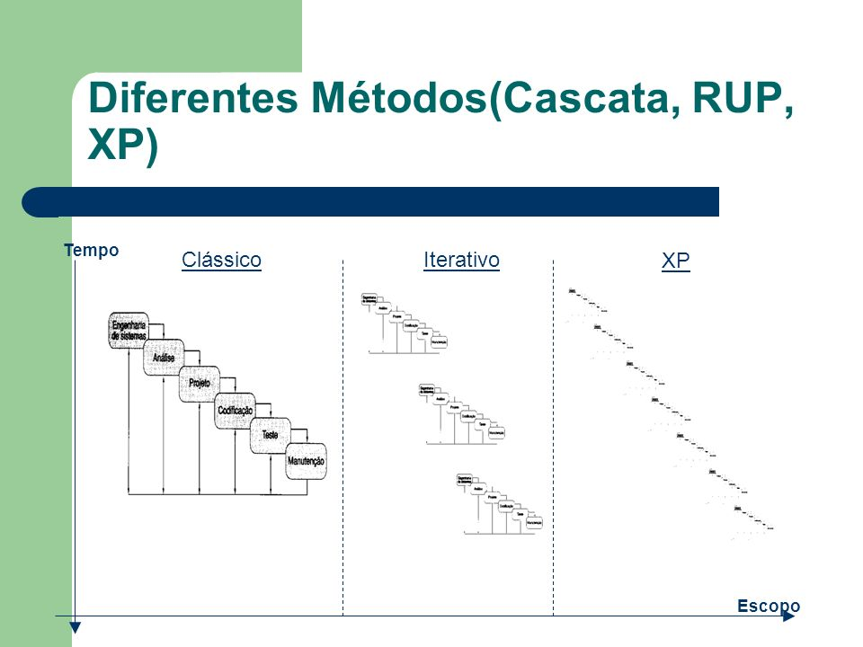
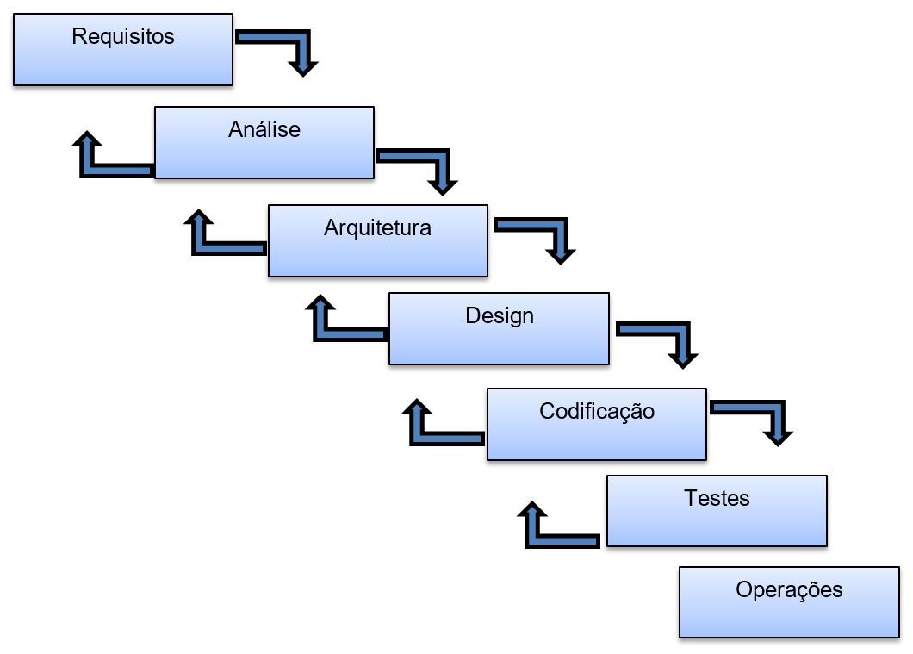
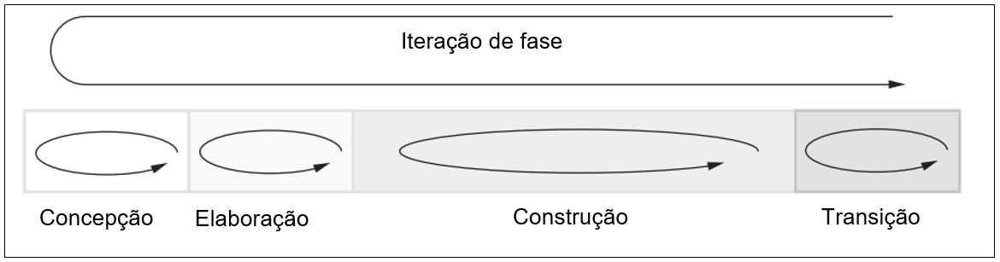
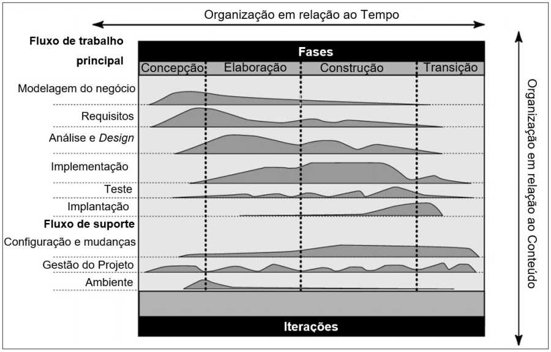
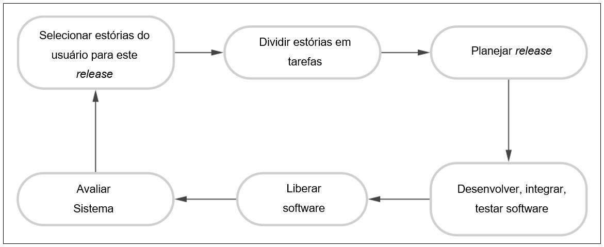

# CASCATA, RUP, XP

## METODOLOGIAS DE DESENVOLVIMENTO

Como todo projeto, o de software não poderia ficar de fora de certas características que definem a necessidade específica de cada situação. Um projeto é criado para resolver problemas diversos, e cada um tem suas prioridades, prazos, orçamentos, pessoas, escopo, ou seja, cada projeto é único e deve ser tratado dessa forma. Por isso, serão apresentadas algumas metodologias de projetos. Projetos que já foram muito utilizados têm sua viabilidade em declínio, e outros estão em constante evolução.

## Cascata

O modelo em cascata enfatiza que uma progressão lógica de etapas deve ser feita ao longo do ciclo de vida de desenvolvimento de software. Suas fases devem ser devidamente conhecidas antes do início do projeto, sendo que a fase seguinte será iniciada somente depois que a anterior tiver sido concluída. Embora sua popularidade tenha diminuído nos últimos anos devido à flexibilidade das metodologias ágeis, a natureza lógica do processo sequencial usado no método cascata não pode ser negada e continua sendo um processo de design comum na indústria. Segundo Engholm (2013, p. 36), há tempo a metodologia em cascata é adequada somente para projetos pequenos, em que todos os requisitos são conhecidos no início e possui baixa probabilidade de sofrer mudanças.

Segundo Sommerville (2011, p. 34), os principais estágios do modelo em cascata refletem diretamente as atividades fundamentais do desenvolvimento:

### 1. Análise e definição de requisitos:

os serviços, restrições e metas do sistema são estabelecidos por meio de consulta aos usuários. Em seguida, são definidos em detalhes e funcionam como uma especificação do sistema. 

### 2. Projeto de sistema e software:

o processo de projeto de sistemas aloca os requisitos tanto para sistemas de hardware como para sistemas de software, por meio da definição de uma arquitetura geral do sistema. O projeto de software envolve identificação e descrição das abstrações fundamentais do sistema de software e seus relacionamentos. 

### 3. Implementação e teste unitário:

durante esse estágio, o projeto do software é desenvolvido como um conjunto de programas ou unidades de programa. O teste unitário envolve a verificação de que cada unidade atenda a sua especificação.

Figura 16. Modelo em cascata.

## RUP – Processo unificado

O UP (Unified Process) é uma opção aberta de mercado, e esse desenvolvimento é realizado com fases incrementais (iterações), sendo que cada iteração possui um escopo definido e produz uma entrega modular. O ciclo de vida incremental tende a reduzir os custos do projeto, a facilitar à equipe que o planejamento dos cronogramas do projeto seja atingido, permitindo melhor acomodação de mudanças no projeto (ENGHOLM, p. 38). O “R” foi um a aquisição feita pela IBM da empresa Rational Software Corporation. O RUP pode ser um guia para melhor utilização da linguagem UML.

Segundo Sommerville (2011, p. 34), o RUP é um modelo constituído de fases que identifica quatro fases distintas no processo de software. No entanto, ao contrário do modelo em cascata, no qual as fases são equalizadas com as atividades do processo, as fases do RUP são estreitamente relacionadas ao negócio, e não a assuntos técnicos.

O Rational Unified Process divide um ciclo de desenvolvimento em quatro fases estáticas consecutivas:

Figura 17. Fases no RUP.

>» Concepção: define-se um business case para o sistema e delimita-se o escopo do projeto. Nessa fase, identificam-se os atores e as entidades externas com as quais o sistema irá interagir. 

>» Elaboração: as metas da fase de elaboração são desenvolver uma compreensão do problema dominante, estabelecer um framework da arquitetura para o sistema, desenvolver o plano do projeto e identificar os maiores riscos do projeto. No fim dessa fase, você deve ter um modelo de requisitos para o sistema, que pode ser um conjunto de casos de uso da UML, uma descrição da arquitetura ou um plano de desenvolvimento do software (SOMMERVILLE, 2011, p. 36). 

>» Construção: nessa fase, todos os componentes de programação e aplicações são desenvolvidos, integrados e testados. Na fase de construção, todos os recursos são direcionados na gestão de recursos e controle de cronograma. 

>» Transição: a fase de transição é inserida quando uma parte do sistema já tenha funcionalidade que poderá ser utilizada pelo usuário final. Nessa fase, é comum surgirem novas versões, pois problemas serão corrigidos pelo fato de o usuário estar testando. A liberação para o usuário final deverá ter um bom nível de qualidade aceitável.

A interação poderá ser feita em cada fase, que poderá originar um subproduto do produto final em desenvolvimento, que crescerá de forma incremental de uma interação pra outra, até se tornar o produto final.

O processo RUP poderá ser dividido em duas dimensões, onde o eixo horizontal representa o prazo e é expresso em forma de ciclo, ou fases, ou iterações. O eixo vertical representa as fases estáticas:

Figura 18. Fase do RUP.

>Os nove processos principais do RUP representam todas as atividades e estão divididos em seis fluxos de processos principais, Modelagem do negócio, Requisitos, Análise e Design, Teste, Implantação, e em três fluxos de suporte, Configuração e mudanças, Gestão de Projeto e Ambiente.

## XP –  Extreme Programing

Com o XP, iniciaram-se os primeiros passos para o desenvolvimento ágil de software. O grande ponto forte é o desenvolvimento interativo, levado a níveis extremos, em que, segundo Sommerville (2011, p. 44), várias novas versões de um sistema podem ser
desenvolvidas, integradas e testadas em um único dia por programadores diferentes, e seus princípios seguem as seguintes práticas para um ciclo de release:

Figura 19. Ciclo de release do XP.

