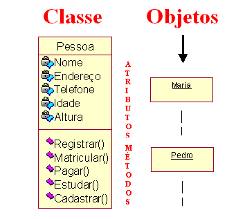
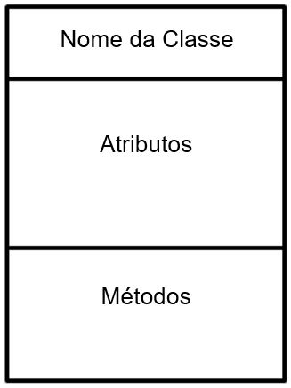
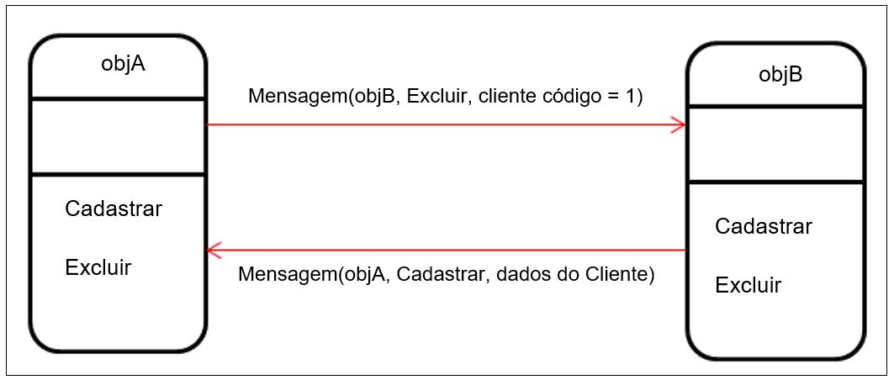
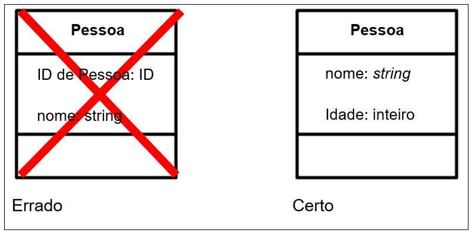
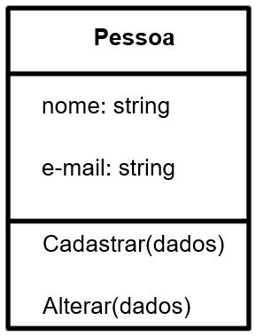
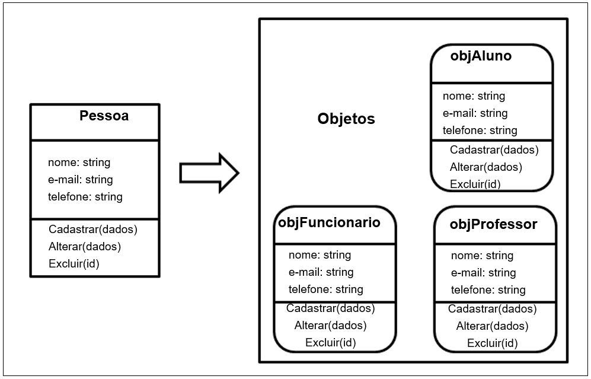

# CLASSES, OBJETOS, ATRIBUTOS E MÉTODOS

## CLASSES

No mundo real, quando os objetos possuem características semelhantes, normalmente são agrupados e classificados. Um exemplo muito utilizado é a segmentação de mercado, realizada pelas empresas de marketing. Supondo que a empresa queira lançar um produto e esse produto só atenderá pessoas com as mesmas características, comportamentos, gostos musicais, idade etc., desse agrupamento de indivíduos surgirá um grupo que será classificado, como, por exemplo, pessoas de interesse. Analisando esse exemplo, podemos facilmente abstrair, para um projeto de modelagem, a classe pessoa e alguns de seus atributos, como nome, e-mail, idade, localização e comportamentos, como andar, comprar, vender, construir, dormir etc. Portanto, Classe será o modelo que foi devidamente classificado com todas as características, comportamento, estado e semântico semelhante, para ser criado um objeto.

### Saiba Mais

>Segundo Dall’oglio (2009, p. 90), classe é uma estrutura estática utilizada para descrever objetos mediante atributos (propriedades) e método (funcionalidades). A classe é um modelo ou template para criação de objetos. Ela é orientada ao assunto, ou seja, cada classe é responsável por um assunto diferente e possui responsabilidades sobre ele.

Graficamente, uma classe é ilustrada como um retângulo separado por três partes:

Figura 20. Definição gráfica de uma Classe.

A parte superior define o nome único da classe no projeto. O espaçamento do meio define todos os atributos e a divisão final, os métodos da classe. O nome da classe deve ser único e de fácil entendimento. Os atributos descrevem as propriedades das classes. Ele é identificado com um nome e um tipo de dado associado. Os métodos definem as funcionalidades das classes e são compostos por nome, tipos de entradas, tipos de saídas e uma lista de argumentos.

>Outro exemplo para ilustrar uma Classe é a famosa “planta de uma casa”. Quando o Engenheiro Civil projeta uma casa, ele utiliza toda a técnica, cálculos, ferramentas, para gerar um “modelo”, que é a planta da casa. Ou seja, a planta será o modelo para se criar uma casa. A casa será um “objeto” criado a partir de um modelo.

Ao final, as definições das classes, seus relacionamentos, ilustrados em diagramas, serão o resultado da etapa do projeto de software. Após serem definidas quais classes irão compor o sistema, será possível implementá-las em uma linguagem de programação.

## OBJETOS

Objeto é uma estrutura dinâmica originada com base em uma classe. Após a utilização de uma classe para se criar diversas estruturas iguais a ela, que interagem no sistema e possuem dados nela armazenados, dizemos que estamos criando objetos ou instanciando objetos de uma classe. Diz que objeto é uma instância de uma classe, porque o objeto existe durante um instante dado de tempo, da sua criação até sua destruição (DALL’OGLIO, 2009, p. 93).

Encontrar e descrever um objeto é o principal objetivo da modelagem a objetos. Certamente, um objeto pode ser uma abstração de algo concreto, como uma pessoa, um carro, uma bicicleta, ou pode ser um conceito ou uma ideia, que possua atributos ou propriedades, que descrevem o estado de um objeto do mundo real, ações ou métodos e um identificador ou nome que o defina como sendo único na representação. Seu conceito é compreender o mundo real e oferecer um entendimento preciso para a implementação em sistemas computacionais. Descrever um objeto dependerá do problema encontrado, e não existe uma representação genérica. Por exemplo, o objeto aluno, modelado para o domínio de uma escola de natação será diferente quando o domínio for uma escola EaD.

Para identificar objetos, Pressman (1995, p. 321) sugere que os objetos se revelam em uma das seguintes maneiras:

- » Entidades externas: outros sistemas que produzem ou consomem informações a serem usadas por um sistema baseado em computador. 
- » Coisas: que fazem parte do domínio do problema. Cartazes, displays, relatórios. 
- » Eventos: que ocorrem dentro do contexto de operação do sistema: movimento de robes, transferência de propriedades. 
- » Papéis: desempenhados por pessoas que interagem com o sistema: gerente, engenheiro. 
- » Unidade organizacional: que são pertinentes a uma organização. Grupos, equipes, departamentos. 
- » Lugares: que estabelecem o contexto do problema e a função global do sistema. Piso de fábrica, local de descarga. 
- » Estruturas: que definem uma classe de objetos ou, ao extremo, classes relacionadas de objetos: sensores, computadores.

### ATENÇÃO

>Muitas vezes, o projetista modela um método como sendo um objeto. Utilizando o exemplo de Pressman (1995, p. 322), imagine se o projetista modelasse como o objeto o nome “inversão de imagem”. Pelo contexto do domínio, “inversão de imagem”seria um método do objeto imagem.

Para nomear um objeto unicamente dentro do projeto, as boas práticas de modelagem recomendam que se inicie com letras minúsculas e que seja um resumo da classe. Também é recomendado que não se utilize acentos, espaços, caracteres especiais. Relacionado a palavras compostas, a mais recomendada é a camel case (objetoA). Nos capítulos que tratam de arquitetura, será demonstrada a especificidade de cada uma.

Quando for implementado por uma linguagem de programação, será no objeto que o processamento ocorrerá. Em termos simples, a classe dará vida ao sistema, por meio da criação de objetos, e estes terão seu tempo de vida definido pelo desenvolvedor ou pelo sistema operacional.

## Mensagem entre objetos

Um mecanismo muito importante ao projeto deverá ser definido antes mesmo que ele entre em implementação: a mensagem. Uma mensagem define como os objetos se comunicarão, e ela terá a seguinte estrutura:

>» mensagem (destino, operação, parâmetros).

O destino define qual objeto receberá a mensagem. Com as novas tecnologias, os objetos poderão estar no mesmo conjunto de objetos ou em softwares externos. A operação é o método interno ao objeto receptor que será executado assim que a mensagem chegar. Os parâmetros são informações contidas na mensagem usada para que a operação seja bem-sucedida.

Figura 21. Comunicação entre objetos.

## ATRIBUTOS

Os atributos são características coletadas no momento de abstrair a classe do mundo real para o mudo computacional. São propriedades como nome, e-mail, telefone, CPF, altura etc. Normalmente, a maioria das classes são criadas com a finalidade de armazenar dados em banco de dados e, por isso, além dos nomes, os atributos devem possuir os tipos de dados, como texto, número, data etc. Outra necessidade para os atributos possuírem um tipo é que, quando forem implementados por uma linguagem de programação, ele se torna uma variável. Em relação aos identificadores únicos, segundo Rumbaugh (1994, p. 35), os identificadores explícitos de objetos não são obrigatórios em um modelo de objetos. Cada objeto tem sua própria e única identidade, as linguagens de programação geram automaticamente identificadores implícitos para referenciar objetos, portanto não é necessário, nem se devem explicitar identificadores.

Figura 22. identificadores internos x atributos do mundo real.

>Os identificadores internos são simplesmente uma facilidade de implementação e não tem significado no domínio do problema. Por exemplo, número do seguro social, número da chapa do carro e número do telefone não são identificadores internos, pois não têm significado no mundo real. Esses atributos são atributos legítimos. (RUMBAUGH, 1994, p. 36).

O atributo também possui um modificador de acesso que poderá ser público ou privado. Esse modificador de acesso é utilizado para definir como um objeto pode ter acesso aos atributos e métodos de outro objeto. Os modificadores de acesso serão tratados com mais detalhes em Encapsulamento.

## MÉTODOS

São procedimentos residentes nos objetos que determinam como eles irão atuar ao serem acionados. Esse acionamento é feito por meio das mensagens, ou seja, pela comunicação entre os objetos. É o método que executa cálculos, manipula dados, retorna mensagens, cria e destrói o objeto, interage com outros objetos etc.

Os métodos são listados no terço inferior da classe, também possuem nomes, tipos de entrada, tipos de saída, tipo de acesso e devem possuir um nome único dentro da classe. Os nomes também devem seguir as boas práticas, porém, por se tratar de uma ação, o método deverá sempre será criado como verbo: cadastrar, incluir, calcular, excluir.

Cada nome de método deve ser seguido pelos detalhes opcionais, como a lista de argumentos e o tipo de resultado. A lista de argumentos é escrita entre parênteses após o nome, e os argumentos são separados por vírgulas. Deve-se nomear cada tipo de argumento. O tipo de resultado é precedido por dois pontos e não deve ser omitido (RUMBAUGH, 1994, p. 37). Caso o método não receba argumentos, devem-se colocar parênteses vazios.

### Saiba Mais

>Existem alguns métodos especiais, como os Construtores, que são responsáveis por criar o objeto quando implementado em alguma linguagem de programação.

Podemos, então, criar uma classe mais completa com todos os conceitos que foram vistos até agora. Digamos que será preciso mapear uma classe, para cadastrar alunos, professores e funcionários de uma escola. Todos eles têm nome, e-mail, telefone como atributos e poderão se cadastrar no sistema e alterar seus dados. Para esse modelo, seria criada a seguinte classe:

Figura 23. Classe com atributos e métodos.

## Instanciação

Para definir instanciação, podemos dizer que a classe é modelo estático que tem o propósito de abstrair “coisas” do mundo real e transformá-la em objetos computacionais. Ou seja, quando o projetista escreve a classe e passa para o desenvolvedor implementá-la para gerar os objetos, o sistema irá instanciar os objetos baseados nas classes. Basicamente, é quando o Engenheiro passa para o construtor a planta e esse constrói a casa, baseada nas informações contidas na planta. Baseando-se na classe pessoa, poderíamos utilizar a seguinte representação gráfica para ilustrar uma instanciação:

Figura 24. Instâncias de Classes: objetos.

