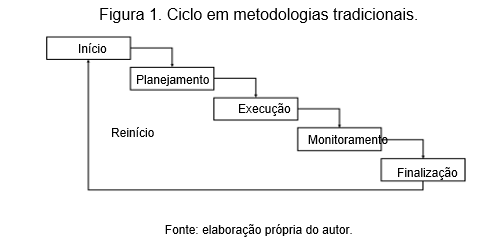

## AGILE VERSUS TRADICIONAL

O gerenciamento de projetos tradicionais segue uma metodologia fixa na qual o projeto é executado em um ciclo sequencial: iniciação, planejamento, execução, monitoramento e finalização. O ciclo significa que um processo só será iniciado quando um anterior estiver terminado. O método tradicional está fortemente fixado em processos lineares, documentação, planejamento antecipado e priorizações. Por herdar semelhanças do PMBOK, o tempo e o orçamento são variáveis, e requisitos fixos.

Em contrapartida, as metodologias ágeis usam abordagens iterativas, e seu principal objetivo é entregar algo de valor a cada ciclo. “Algo de Valor” significa entregar o software funcionando do módulo que o cliente definiu como prioridade alta, de maior importância ao negócio. As entregas têm um prazo curto, de uma a quatro semanas, ao contrário do método clássico, que é feito em sequências. As tarefas não concluídas têm um tratamento de priorização e serão incluídas em entregas futuras, e os estágios do ciclo de vida serão revisados conforme necessidades, ao contrário dos requisitos fixos das metodologias clássicas.

